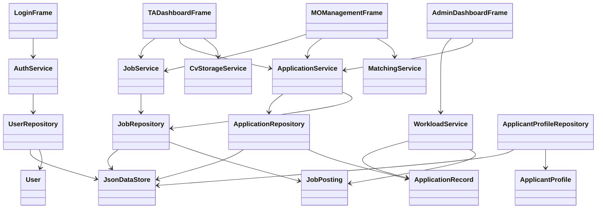

# Design Summary

## System Overview
The system is a stand-alone Java Swing application for Teaching Assistant recruitment management. It supports three roles:
- TA Applicant
- Module Organiser
- Admin

All persistent data is stored in local JSON files under `data/`. No database is used.

## Use Cases
- TA registers and logs in
- TA edits profile and CV path
- TA browses jobs and applies
- TA tracks application status
- MO posts or edits a job
- MO reviews applicants for a selected job
- MO shortlists, accepts, or rejects applicants
- Admin reviews workload totals and overload warnings
- Admin loads demo data and reviews rebalance suggestions

## Architecture
- `model`: entities and enums
- `repository`: file access for JSON persistence
- `service`: business rules and workflow orchestration
- `ui`: Swing boundary classes
- `util`: shared helpers and sample data

The design follows separation of concerns. Swing frames do not write JSON files directly; they call services such as `AuthService`, `JobService`, `ApplicationService`, `MatchingService`, and `WorkloadService`. Repository classes hide file access behind simple methods such as `findAll()` and `saveAll()`. This keeps the design modular, easier to test, and loosely coupled.

## UML / Package-Level Design

This simplified class/package diagram is used in the demonstration video to show how the implementation maps back to the design: UI classes depend on services, services depend on repositories and models, and repositories depend on `JsonDataStore`.

## Persistence Design
The system stores data in:
- `data/users.json`
- `data/profiles.json`
- `data/jobs.json`
- `data/applications.json`
- `data/config.json`
- `data/messages.json`
- `data/notifications.json`
- `data/allocations.json`

`JsonDataStore` initializes files if they do not exist, so the application can start from a fresh clone.
To reduce the risk of data corruption, JSON writes use a temporary file and then replace the target data file.

## Security Design
Passwords are stored as SHA-256 hashes through `PasswordUtil`, not as plain text. Login uses `PasswordUtil.matches(rawPassword, storedPassword)`. For compatibility with older demo data, a legacy plain-text password can be accepted once and then migrated to a hash.

## Skill Matching Logic
1. Normalize applicant and required skills to lowercase trimmed values.
2. Compare required skills against applicant skills.
3. Count exact matches.
4. Allow an explicit synonym map for a few easy-to-explain equivalents such as `Agile -> Scrum`.
5. Score = matched required skills / total required skills.
6. Output matched skills, missing skills, and an explanation string.

Example:
- Required: `Java, Agile, Communication`
- Applicant: `Java, Communication`
- Score: `67%`
- Missing: `Agile`

## Workload Logic
1. Find applications with status `ACCEPTED`
2. Join accepted applications to their jobs
3. Sum job hours per applicant
4. Compare total hours against the configured threshold
5. Mark records above the threshold as overload

## Trade-Offs
- JSON replaces a database because the coursework forbids database use.
- Swing keeps the project lightweight and runnable in a classroom demo.
- SHA-256 password hashing improves the demo security model, although a production system would normally use salted adaptive hashing such as bcrypt or Argon2.
- The workload model separates weekly course-support workload from one-off activity workload. This is simple and explainable for the coursework demo, while full calendar conflict detection is left as future work.
