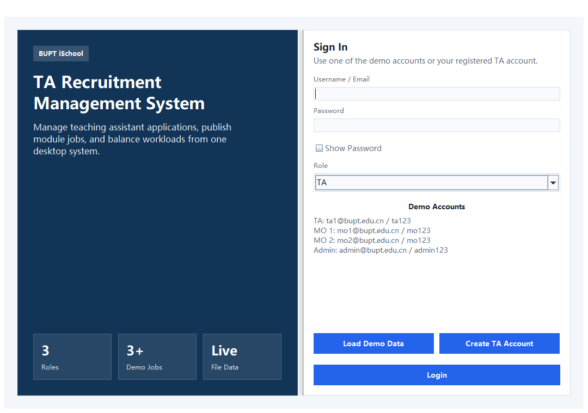
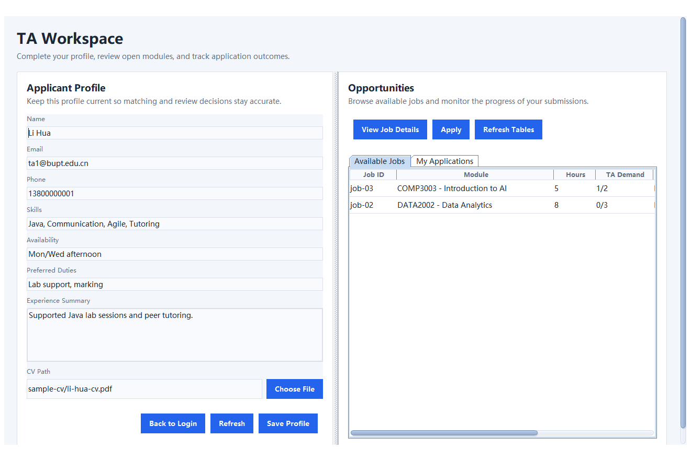
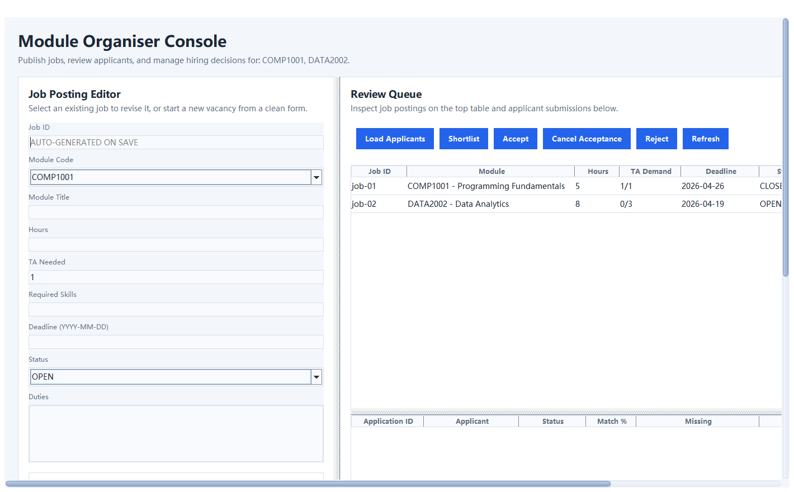
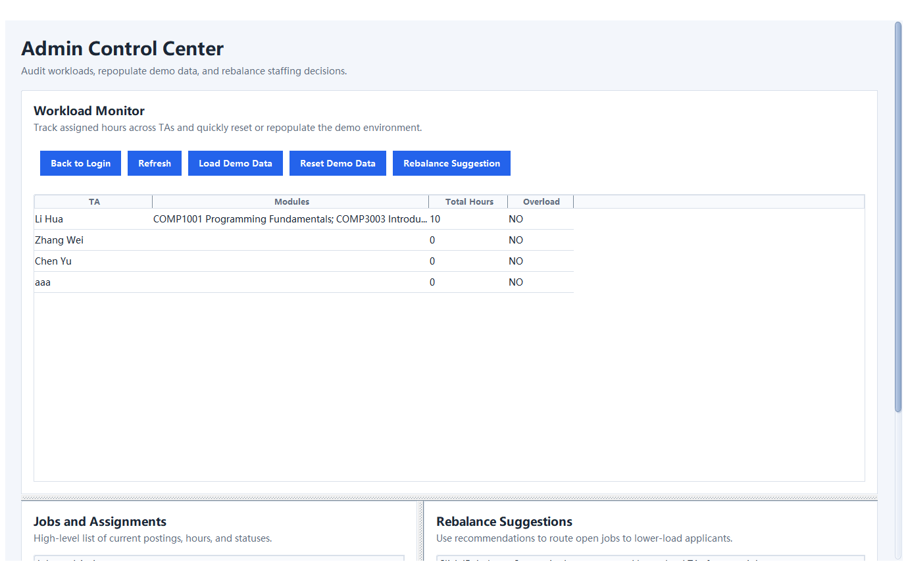

# User Manual

## Overview
This application supports three roles:
- `TA Applicant`
- `Module Organiser (MO)`
- `Admin`

All data is stored locally in JSON files under `data/`. No database is required.

## Setup
1. Install Java 17 or later.
2. Open the project root folder.
3. Start the application with one of the following methods:

```bash
java -cp target/classes app.Main
```

or

```text
run.bat
```

If you want Maven to verify the project first:

```bash
mvn test
```

## Demo Accounts
- `TA`: `ta1@bupt.edu.cn` / `ta123`
- `MO`: `mo1@bupt.edu.cn` / `mo123`
- `Admin`: `admin@bupt.edu.cn` / `admin123`

## Main Screens

### Login Screen
Use this screen to sign in, load sample data, or create a TA account.



### TA Dashboard
The TA dashboard is used to maintain the applicant profile, choose a CV file, browse open jobs, apply, withdraw non-finalized applications, and track application results.



### MO Dashboard
The MO dashboard is used to manage jobs, review applicants, write reviewer notes, sort and filter applicants, and change job status through guarded selection workflows.



### Admin Dashboard
The Admin dashboard is used to monitor TA workloads, inspect jobs, view summary cards, reset demo data, and generate rebalance suggestions.



## TA Applicant Workflow
1. Log in as a TA user.
2. Complete the profile form on the left side.
3. Click `Choose File` to select a CV.
4. Click `Save Profile`.
5. In `Available Jobs`, select an open job.
6. Click `View Job Details` if needed.
7. Click `Apply` to submit the application.
8. Open `My Applications` to track:
- status
- match score
- missing skills
- reviewer notes
9. Select any application and click `View Application Details` to open a summary popup with:
- status
- reviewer notes
- match score
- missing skills
- TA demand
- deadline
10. If an application is still under review, select it and click `Withdraw Application`.

### TA Notes
- Only `OPEN` jobs are shown in `Available Jobs`.
- `TA Demand` is shown as `accepted / required`.
- Withdrawn applications are marked as `WITHDRAWN` instead of being deleted.
- A withdrawn or rejected application can be submitted again later for the same job.
- Empty tables show a helper message instead of a blank area.

## MO Workflow
1. Log in as an MO user.
2. Select an existing job or create a new one.
3. Fill in module code, title, hours, TA needed, skills, deadline, status, and duties.
4. Click `Save Job`.
5. Select a job in the right table and click `Load Applicants`.
6. Select an applicant to review:
- match details
- missing skills
- applicant summary
- reviewer notes
7. Use the applicant status filter to narrow the list to `Submitted`, `Shortlisted`, `Accepted`, `Rejected`, or `Withdrawn` records if needed.
8. Use the sort box to rank applicants by:
- match score high to low
- match score low to high
- applicant name
- status
9. Use `Shortlist`, `Accept`, `Reject`, or `Cancel Acceptance` as needed.
10. Confirmation dialogs are shown before high-impact review actions.

### Job Status Rules
- Changing `OPEN -> CLOSED` requires the MO to choose the TA(s) who will be accepted before the change is saved.
- Changing `CLOSED -> OPEN` requires the MO to choose which accepted TA(s) will be removed before recruitment can continue.
- `TA Demand` is shown as `accepted / required`.
- Status cells use color badges to make `OPEN`, `CLOSED`, and application states easier to scan.
- Deadline cells are highlighted when a deadline is very close or already overdue.
- If there are no applicants yet, or if the current filter returns no rows, the applicant table shows a matching helper message.

## Admin Workflow
1. Log in as an Admin user.
2. Use the summary cards at the top of the workload view to monitor:
- open jobs
- closed jobs
- total applications
- accepted TAs
3. Use `Refresh` to reload current workload data.
4. Use `Load Demo Data` to repopulate the sample dataset.
5. Use `Reset Demo Data` to clear and reset the dataset.
6. Use `Rebalance Suggestion` to view simple recommendations for open jobs.
7. A confirmation dialog is shown before resetting demo data.

## Data Files
The application stores all data in:
- `data/users.json`
- `data/profiles.json`
- `data/jobs.json`
- `data/applications.json`
- `data/config.json`

## Common Notes
- TA users must save a CV path before applying.
- Closed jobs cannot accept new applications.
- Reviewer notes entered by MO users are shown to TA users in `My Applications`.
- Automated tests can be run with `mvn test`.
